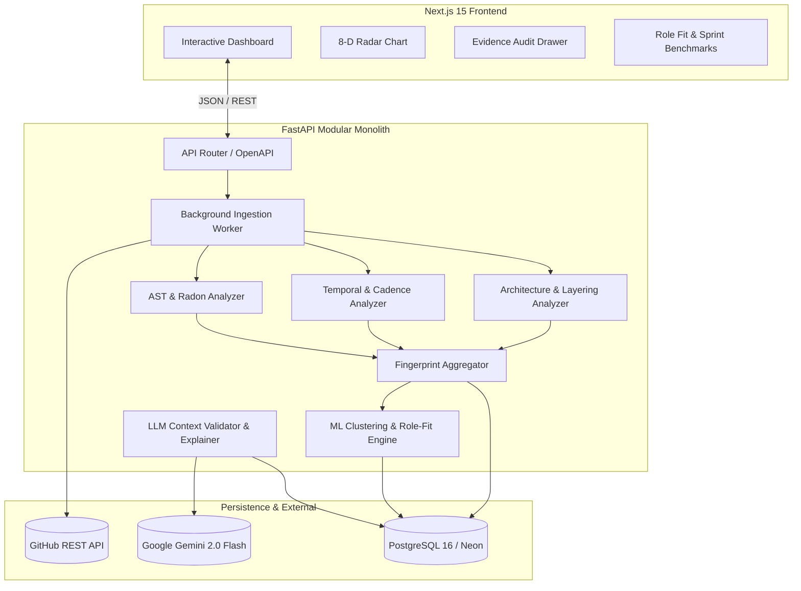

# 🪞 MIRROR AI

> **Developer Intelligence Platform** — Learns observable software-engineering behavior from GitHub history and turns it into an evidence-backed developer profile.

[](https://mirror-ai-khaki-phi.vercel.app/)
[](https://mirror-ai-0nkn.onrender.com/docs)
[](https://neon.tech)
[](https://fastapi.tiangolo.com)
[](https://nextjs.org)
[](https://www.python.org)
[](https://www.typescriptlang.org)
[](https://github.com/AyushYele25/MIRROR_AI-)
[](https://opensource.org/licenses/MIT)

🌐 **Live Application**: [https://mirror-ai-khaki-phi.vercel.app/](https://mirror-ai-khaki-phi.vercel.app/)  
📖 **Interactive API Documentation (Swagger UI)**: [https://mirror-ai-0nkn.onrender.com/docs](https://mirror-ai-0nkn.onrender.com/docs)  
🩺 **API Health Endpoint**: [https://mirror-ai-0nkn.onrender.com/health](https://mirror-ai-0nkn.onrender.com/health)

---

## 🎯 Product Vision & Core Principle

**MIRROR must not pretend to infer personality.** It models observable engineering behavior from software artifacts with rigorous evidence trails, uncertainty estimation, and privacy controls.

Instead of subjective buzzwords ("passionate", "creative", "rockstar"), MIRROR delivers **quantified, forensic insights** derived directly from AST analysis, code churn, architecture decomposition, and test coverage.

```
GitHub API ──► Evidence Extraction ──► 8-Dimension Fingerprint ──► Role-Fit Gap Engine ──► Grounded Insight Report
```

---

## 🏗️ Architecture



---

## 🔬 The 8-Dimension Engineering Fingerprint

Every developer profile synthesizes 23+ raw extracted metrics across eight core dimensions (normalized 0–100):

| Dimension | Underlying Metrics | Description |
| :--- | :--- | :--- |
| **Code Quality** | Maintainability Index, Cyclomatic Complexity, Avg Function Length, Duplication Proxy | Code readability, structural cleanliness, and cognitive load |
| **Testing** | Test File Ratio, Test Commit Ratio, CI/CD Pipeline Detection | Automated testing discipline, regression prevention, and CI presence |
| **Architecture** | Module Count, Layering Score, Dependency Fan-Out, Project Complexity | Separation of concerns (routes, services, repositories, schemas) |
| **Documentation** | README Word Density, Docstring Ratio, Inline Comment Ratio | Knowledge sharing, onboarding clarity, and API explanation |
| **Iteration** | Commit Cadence / Week, Active Days Ratio, Median Change Size | Regularity of shipping, development velocity, and sprint pacing |
| **Debugging** | Fix Ratio, Revert Proxy, Hotfix Patterns | Bug-fix frequency, troubleshooting patterns, and error recovery |
| **Tooling** | Docker, Pre-commit, Linters (ruff/flake8/eslint), Type Checking (mypy/ts) | Modern toolchain adoption and environment reproducibility |
| **ML Workflow** | Model Files, Training Scripts, Metric Evaluations, Notebook Ratios | Specialized machine learning and data science engineering hygiene |

---

## 💼 Role-Fit Benchmark System

MIRROR compares developer profiles against observable skill benchmarks for 5 target industry roles:

1. **Machine Learning Engineer** (emphasis on ML pipelines, Docker, clean Python, model evaluation)
2. **Software Engineer** (emphasis on code maintainability, comprehensive testing, layering, CI/CD)
3. **Data Scientist** (emphasis on notebooks, documentation, exploratory cadence, data pipelines)
4. **Data Engineer** (emphasis on ETL architecture, tooling, infrastructure, pipeline resilience)
5. **AI Engineer** (emphasis on API model serving, inference pipelines, containerization, system design)

Each analysis produces:
- **Fit Match Percentage** (0–100%)
- **Dual Observed vs Target Gap Indicators**
- **Recommended Next Challenge Blueprint** (a 2–4 week targeted project to close top skill gaps)

---

## 🔒 Forensic Evidence & Privacy First

1. **100% Grounding Rule**: No metric or insight is presented without a clickable evidence audit trail linking directly to the repository, file, or commit SHA.
2. **LLM Boundary**: LLMs (Gemini) are strictly isolated from scoring algorithms. They only generate natural-language explanations of deterministic pre-computed facts.
3. **Privacy Purge**: Includes a one-click delete endpoint (`DELETE /api/profile/{username}`) that cascades and permanently purges all stored analysis data for a user.

---

## 🚀 Quickstart Guide

### Prerequisites
- Python 3.12+
- Node.js 20+
- (Optional) Docker & Docker Compose

### 1. Run with Docker Compose (Recommended)

```bash
docker-compose up --build
```
- Frontend: `http://localhost:3000`
- Backend API Docs: `http://localhost:8000/docs`
- Database: PostgreSQL on port `5432`

---

### 2. Manual Local Development

#### Backend Setup:
```bash
cd backend
python -m venv venv
# Windows
.\venv\Scripts\activate
# Unix/macOS
source venv/bin/activate

pip install -r requirements.txt
pip install scikit-learn

# Run migrations & start server
uvicorn app.main:app --reload --port 8000
```

#### Frontend Setup:
```bash
cd frontend
npm install
npm run dev
```

Visit [http://localhost:3000](http://localhost:3000).

---

## 🧪 Testing

The repository features comprehensive automated test coverage with **95 unit tests** passing across all modules:

```bash
cd backend
pytest tests/ -v
```

Tests cover:
- `test_ast_features.py`: AST parsing, Radon metrics, complexity, test file detection
- `test_history.py`: Commit classification (fix/refactor/feat), cadence, code churn, streaks
- `test_profile.py`: Repo feature vector aggregation, developer fingerprint synthesis
- `test_ml.py`: Cosine similarity, nearest-neighbor matching, role-fit gap analysis, LLM validators
- `test_normalizer.py`: Language detection, GitHub API schema normalization
- `test_schemas.py`: Pydantic request/response validation

---

## 📄 License

Distributed under the [MIT License](LICENSE).
